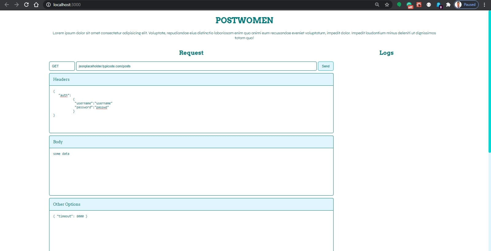

# ✔️POSTWOMAN

## An HTTP client that lets you set your request as you like and send it throw the web afterwards

personalize the request, Set:

- the headers
- the http method
- the body
- the timeout
- the data that you want to send
- the authentication params
- the request params & queries as an plain JS object
- the max body length
- the proxy
- the response type
- ...

### [Demo](https://abdell.tech/postwoman)

### The Request



### The Response


### Clone The Project

```bash
git clone https://github.com/Abdelar/postwoman.git
cd postwoman
npm i
# to run a local server
npm start
# to build the project for production
npm run build
```
