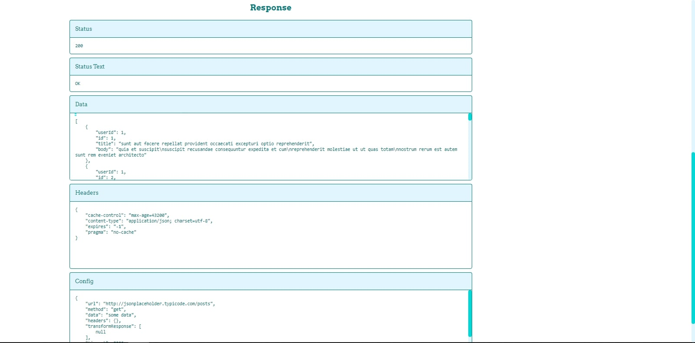

# POSTWOMEN

## An HTTP client that lets you set your request as you like and send it throw the web afterwards

personalize the request, Set:

- the headers
- the http method
- the body
- the timeout
- the data that you want to send
- the authentication params
- the request params & queries as an plain JS object
- the max body length
- the proxy
- the response type
- ...

### The Request

### The Response

This project is not complete and still under development.
See the source code on [github](https://github.com/Abdelar/http-client).
